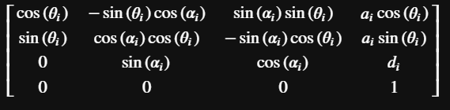
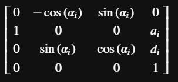
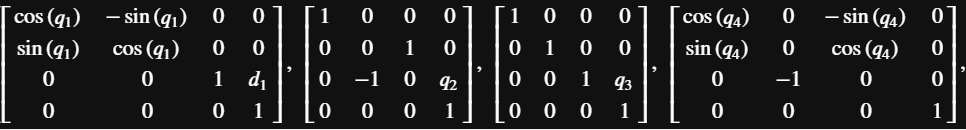
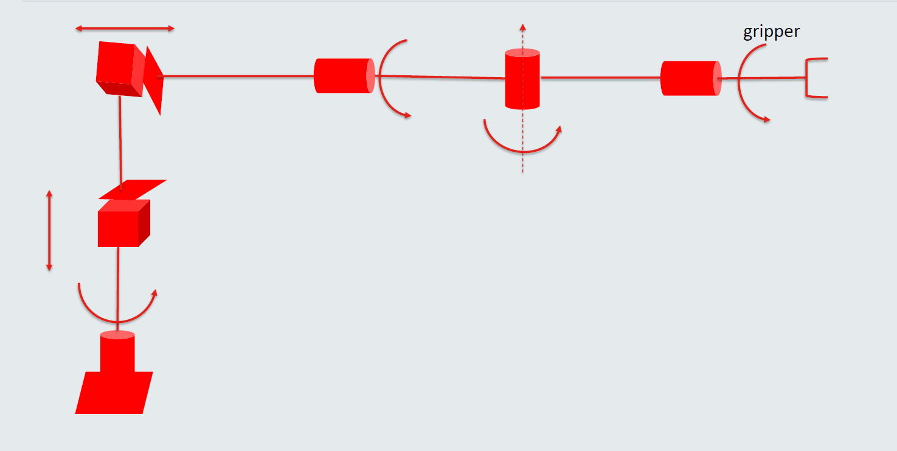

# Robotics Tool Set

#### Ziang Chen @ Kings College London
#### Original

## Description
This project aim to contain most of Deduction and Calculation in Robotics, both **Numeric** and **Symbolic**.

The Basic symbolic math tool realized include **Scalar, Vector, Matrix** and generally **Tensor**

The math functor realized include **partial differential** ,**Jacobian**, **tensor transform** and some related topic constructed by these 

The application obviously contains **coordinate transform, Direct/ Inverse Kinematic, Dynamics** and **Trajectory Planning**

Using such math tool, it also can easly represently the most advanced topic like **Lie Algebra** and **non-linear control**

## Functions
### Coordinate Related
### Kinematic
##

## The main function
  * Numeric Calculate
  * Coordinate Transform
  * Symbolic Calculate
  * Direct kinematic
  * Fomula Deductive
  * Dynamic Calculate
  * Jacobian

## Function Illustrate

 * Tensor Representation And Transform
 
  

 * The transform_matrix
 
  

 * Numeric Calculation
 
   E.G. Theta_i=pi/2
   
 

 * Automatic Generate The transform Matrix Based on specific Robot Configuration
   
   E.G. The 1 - 3 Coordinate Transform Matrix for Following Robot Mechanism
   
 
 
 

